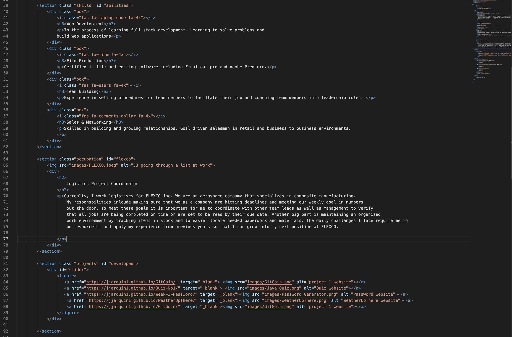
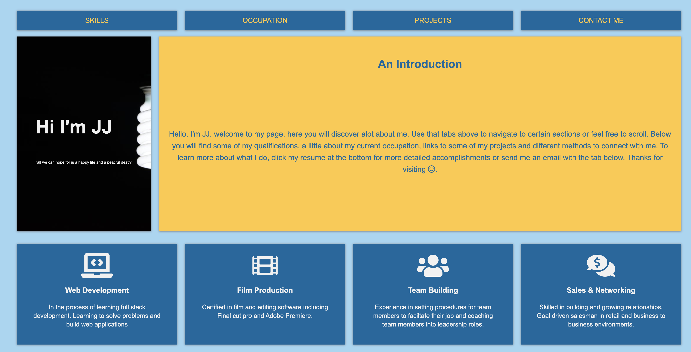

# Week-2-Portfolio
I'm creating a professional portfolio 

# html

Restructure entire HTML document. first created sections for each of my tabs, including my introduction, my skills, my portfolio and my contact information. 
Second I created a slider for all my portfolio section and attached images and added alt tags. 
Third I linked the href links. 

# css

For the CSS I first created root variables to use throughout my page. 

Created a container to wrap up all the sections and assigned it a grid display.
throughout the sections i assigned a grid display and divided into fractions or grid area. 

Images were given a 100% width to fit container. Throughout the page I stuck with 4 main colors. 

check out my portfolio! @ https://jjarquin1.github.io/helloJJ/